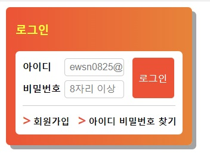

# 과제2 : position

## 스크린샷

</img>
<br/><br/>

## HTML 구조

```
<body>
  <div class="container">
    <h3>로그인</h3>
    <div class="login_wrap">
      <form action="/" method="post" class="login_form">
        <fieldset>
          <legend>로그인 폼</legend>
          <div class="login_form_group">
          </div>
        </fieldset>
      </form>
      <ul class="for_login_group">
      </ul>
    </div>
  </div>
</body>
```
> 구조는 크게 제목 영역과 로그인을 진행하기 위한 login_wrap 영역으로 나누었고, login_wrap은 다시 login_form 영역과 회원가입 및 아이디 비밀번호 찾기 기능이 있는 for_login_group 영역으로 나누었습니다.


<br/><br/>
### 마크업 순서 
<br/>
1. 로그인(제목)

```
<h3>로그인</h3>
```
> h3 요소를 사용하여 제목을 주었습니다.


<br/><br/>
2. 아이디 레이블과 입력서식
```
<div class="login_box">
  <label for="id">아이디</label>
  <input type="text" id="id" name="id" required placeholder="ewsn0825@naver.com" />
</div>
```
> 아이디 레이블과 입력서식을 만든 뒤 login_box로 묶어주었습니다.

<br/><br/>
3. 비밀번호 레이블과 입력서식
```
<div class="login_box">
  <label for="pwd">비밀번호</label>
  <input type="password" id="pwd" name="pwd" required placeholder="8자리 이상" minlength="8" />
</div>
```
> 마찬가지로 비밀번호 레이블과 입력서식을 만든 뒤 login_box로 묶어주었습니다.

<br/><br/>
4. 로그인 버튼
```
<button type="submit" class="btn">로그인</button>
```
> button 요소를 사용하여 로그인 버튼을 만들었습니다.

<br/><br/>
5. 회원가입 및 아이디/비밀번호 찾기 링크
```
<ul class="for_login_group">
  <li><a href="/"><span>&gt;</span>회원가입</a></li>
  <li><a href="/"><span>&gt;</span>아이디 비밀번호 찾기</a></li>
</ul>
```
> a 요소와 span 요소를 li로 묶어준 다음 ul 요소로 그루핑하였습니다.

<br/><br/>
<hr/>

## CSS 
<br/><br/>
### 조건 1. 일부 요소의 배치를 position 속성을 활용하여 구현

```
/* 데스크탑 로그인 폼 영역*/
.login_form{
  position: relative;
  width: 100%;
  height: 50%;
  margin-top: 0.5rem;
  /* background-color: #ffffff; */
  border-radius: 0.3125rem;
}

.btn{
  position: absolute;
  right: 0.9rem;
  top: 0.7rem;
  text-align: center;
  font-size: 1rem;
  color: #ffffff;
  width: 4.375rem;
  height: 4.25rem;
  background-color: #ED552F;
  border:0;
  border-radius: 0.3125rem;
}
```
<br/>

### 조건 2. 회원가입, 아이디/비밀번호 찾기 영역은 float을 활용하여 구현

```
/* 회원가입, 아이디 비밀번호 찾기 영역 */

.for_login_group{
  list-style-type: none;
  display: flow-root;
  font-size: 0.95rem;
  margin: 0;
  padding: 5px 10px 10px 10px;
}

.for_login_group li:first-child{
  float: left;
}

.for_login_group li:last-child{
  float: right;
}
```

### 그 외

<br/>

* background 및 border-radius
```
.container{
  width: 17.5rem;
  height: 12.5rem;
  padding: 1rem;
  border-radius: 0.4375rem;
  background: linear-gradient(90deg, #ED552F 0%, #E8852E 100%);
  box-shadow: 7px 7px #A3A3A3;
}

.login_wrap{
  background-color: #ffffff;
  border-radius: 0.4375rem;
}
```


* label과 input
```
label{
  font-size: 1rem;
  font-weight: bold; 
}

input{
  padding: 0.3125rem 0  0.3125rem 0.5rem;
  font-size: 1rem;
  border: 1px solid #CCCCCC;
  border-radius: 0.3125rem;
  width: 5.625rem;
}
```