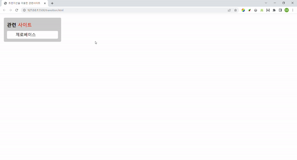

# 과제3 : Transition

## 스크린샷

<br/>

</img>
<br/><br/>

## HTML 구조

```
<body>
  <div class="container">
    <h2>관련 <span>사이트</span></h2>
    <div class="content_box">
      <ul class="content_wrap">
        <li><a href="/">제로베이스</a></li>
        <li><a href="/">W3C</a></li>
        <li><a href="/">데이원 컴퍼니</a></li>
        <li><a href="/">웹 접근성 연구소</a></li>
        <li><a href="/">MDN</a></li>
      </ul>
    </div>
  </div>
</body>
```
> 마크업 구조는 전체 영역인 container와 제목에 해당되는 h 태그, 그리고 내부에 있는 ul, li, a 태그를 묶어주는 content_box를 만들어 주었습니다.


<br/><br/>
### 마크업 순서 
<br/>
1. 관련사이트(제목)

```
<h2>관련 <span>사이트</span></h2>
```
> h2 요소를 사용하여 제목을 주었습니다. "사이트"에 해당되는 글자를 꾸미기 위해 span을 이용하였습니다.


<br/><br/>
2. a 태그와 ul(순서없는 리스트) 
```
<ul class="content_wrap">
  <li><a href="/">제로베이스</a></li>
  <li><a href="/">W3C</a></li>
  <li><a href="/">데이원 컴퍼니</a></li>
  <li><a href="/">웹 접근성 연구소</a></li>
  <li><a href="/">MDN</a></li>
</ul>
```
> ul과 li 태그를 사용하여 리스트 5개를 생성하였고 각각 li 태그 안에는 a 태그를 담아 서로 다른 링크를 줄 수 있도록 하였습니다.

<br/><br/>
<hr/>
<br>

## CSS 
<br/><br/>

### 트랜지션 영역


```
/* 트랜지션 영역 */

.content_box{
  
  background-color: white;
  border-radius: 5px;
  height: 2.5rem;
  
  transition: height 500ms;

  /* 넘친 컨텐츠 요소 안보이기 */
  overflow: hidden;

  cursor: pointer;

}

.content_wrap{
  margin: 0;
  list-style-type: none;

  transition: transform 500ms 500ms;
}

.content_box:hover{
  height: 13.125rem;
}

.content_wrap:hover{
  transform: translateY(10px);
}
```


<br/>

### 그 외

<br/>

* background 및 border-radius / margin , padding

```
body{
  padding: 0;
  margin: 0;
}

h2{
  margin: 0.25rem 0 1rem 0;
}

span{
  color: #ED552F;
}

a{
  text-decoration-line: none;
  color: black;
  font-size: 1.3rem;
}

.container{
  background-color: #CCCCCC;
  width: 16.5rem;
  /* height: 16.5rem; */
  padding: 1rem;
  margin: 1.25rem;
  border-radius: 5px;
}

.content_wrap li{
  padding: 0.3125rem;
}

```
