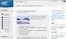

# 과제3 : Transition

## 스크린샷

<br/>

</img>
<br/><br/>

## HTML 구조

```
<body>
  <section class="container">
    <div class="head_box">
      <h4>새소식</h4>
      <button type="button" aria-label="더보기 버튼">더보기</button>
    </div>
    <div class="content_box">
      <figure>
        
        <figcaption>W3C 리뉴얼</figcaption>
      </figure>
      <p class="news_main">W3C 사이트가 리뉴얼 되었습니다.</p>
      <p class="news_date">2022.07.18</p>
      <p class="news_sub">디자인 및 다양한 view 환경을 고려하여 구성되어 있으며,
        기존보다 최신 정보 및 개발자를 위한 기술 가이드도 찾기 쉽도록
        구성되어 있습니다.
      </p>
    </div>
  </section>
</body>
```
> 마크업 구조는 전체 영역인 container를 만들어주었고 제목에 해당되는 h 태그, 더보기 기능을 담고있는 button을 head_box로 묶어주었습니다. 또한 이미지를 담고있는 figure 요소와 p 태그를 content_box로 묶어주었습니다.


<br/><br/>
### 마크업 순서 
<br/>
1. 새소식(제목)

```
<h4>새소식</h4>
```
> h4 요소를 사용하여 제목을 주었습니다.


<br/><br/>
2. 버튼
```
<button type="button" aria-label="더보기 버튼">더보기</button>
```
> 더보기 버튼을 만들어 주었습니다. 

<br/><br/>
3. figure 요소
```
<figure>
  
  <figcaption>W3C 리뉴얼</figcaption>
</figure>
```
> figure 요소로 이미지와 figcaption을 묶어주었습니다.

<br/><br/>
4. p 요소
```
<p class="news_main">W3C 사이트가 리뉴얼 되었습니다.</p>
      <p class="news_date">2022.07.18</p>
      <p class="news_sub">디자인 및 다양한 view 환경을 고려하여 구성되어 있으며,
        기존보다 최신 정보 및 개발자를 위한 기술 가이드도 찾기 쉽도록
        구성되어 있습니다.
      </p>
```
> 컨텐츠 설명이 있는 부분을 각각 p 요소로 묶어주었습니다.

<br/><br/>
<hr/>
<br>

## CSS 
<br/><br/>

### 그리드 영역


```
/* 그리드 영역 */

.content_box{
  width: 100%;
  height: 9.625rem;

  display: grid;
  grid-template-rows: auto;
	grid-template-columns: repeat(6, 1fr);
  column-gap: 1rem;
}

.news_main{
  height: 1.25rem;
  font-weight: bold;
  grid-row: 1 / 1;      
  grid-column: 2 / 7; 
   
}

.news_date{
  height: 1.25rem;
  grid-row: 2 / 2;      
  grid-column: 2 / 7; 

}

.news_sub{
  grid-row: 3 / 4;      
  grid-column: 2 / 7; 
  
  line-height: 1.5rem;
}
```


<br/>

### float을 이용한 head_box 배치

<br/>

```
.head_box{
  width: 100%;
  display: flow-root;
}

h4{
  color: #ED552F;
  float: left;
}

button{
  border: 0;
  background: #FFFFFF;
  float: right;
  font-size: 1rem;
  font-weight: bold;
  cursor: pointer;
}

```

### 가상요소를 이용해 그라디언트 선 만들기

<br/>

```
.head_box::after{
  content: "";
  display: block;
  background: linear-gradient(90deg, #A9A9A9 -1.32%, #FFFFFF 100%);
  width: 100%;
  height: 1px;
  clear: both;
  margin: 2.25rem 0 1rem 0;
  
}

```