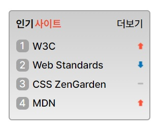

# 과제5 : sprite 다루기

## 스크린샷

<br/>

</img>
<br/><br/>

<hr/>

## HTML 구조

```
<section class="container" aria-label="인기사이트 순위">

  <h3 class="title">인기<span>사이트</span></h3>

  <ol class="content_wrap">
    <li class="list_item">
      <a class="item_link" href="/">W3C</a>
      <span class="sprite sprite_up"></span>
    </li>
    <li class="list_item">
      <a class="item_link" href="/">Web Standards</a>
      <span class="sprite sprite_down"></span>
    </li>
    <li class="list_item">
      <a class="item_link" href="/">CSS ZenGarden</a>
      <span class="sprite sprite_keep"></span>
    </li>
    <li class="list_item">
      <a class="item_link" href="/">MDN</a>
      <span class="sprite sprite_up"></span>
    </li>
  </ol>
    
  <a class="more_link" href="/" aria-label="더보기 버튼">더보기</a>
</section>

```
> section 태그를 사용해 전체 영역인 container를 만들어주었습니다. 그 안에는 제목에 해당되는 h 태그를 사용하였고 일부를 span 요소로 감싸 꾸며주었습니다. ol 태그로 순서있는 리스트를 만들어 주었고, li 안에는 링크에 해당되는 a 요소와 아이콘을 넣어줄 span 요소를 넣었습니다. 그리고 더보기 버튼에 해당되는 a태그를 만들어주었습니다.


<br/><br/>
### 마크업 순서 
<br/>
1. 인기사이트(제목)

```
<h3 class="title">인기<span>사이트</span></h3>
```
> h3 요소를 사용하여 제목을 주었고 특정부분을 꾸며주기위해 span 요소를 사용하였습니다.


<br/><br/>
2. 순서있는 리스트(ol)
```
<ol class="content_wrap">
  <li class="list_item">
    <a class="item_link" href="/">W3C</a>
    <span class="sprite sprite_up"></span>
  </li>
  <li class="list_item">
    <a class="item_link" href="/">Web Standards</a>
    <span class="sprite sprite_down"></span>
  </li>
  <li class="list_item">
    <a class="item_link" href="/">CSS ZenGarden</a>
    <span class="sprite sprite_keep"></span>
  </li>
  <li class="list_item">
    <a class="item_link" href="/">MDN</a>
    <span class="sprite sprite_up"></span>
  </li>
</ol>
```
> 순서있는 리스트를 생성한 후 li로 4개의 리스트를 만들어 주었습니다. 각 li에는 사이트에 해당되는 링크를 내포한 a 요소와 sprite 이미지를 사용하기 위한 span 요소를 넣어주었습니다.   

<br/><br/>
3. 더보기 버튼
```
<a class="more_link" href="/" aria-label="더보기 버튼">더보기</a>
```
> a 태그를 사용해 더보기 버튼을 만들어 주었습니다.


<br/><br/>
<hr/>
<br>

## CSS 
<br/><br/>

### sprite 영역


```
/* sprite */
.sprite{
  margin-left: auto;
  background: url(rank.png) no-repeat;
  height: 11px;
  width: 8.5px;
}

.sprite_up{
  background-position: 0px 0px;

}
.sprite_keep{
  background-position: 0px -22.5px;
  
}
.sprite_down{
  background-position: 0px -45px;
}
```


<br/>

### 가상요소를 사용한 숫자 박스

<br/>

```
/* li 태그 */
.list_item{
  display: flex;
  flex-flow: row nowrap;
  align-items: center;
  
  padding: 0.3125rem 0; 
  font-size: 1rem;

  counter-increment: number;
}


/* 숫자 박스 */
.list_item::before{
  
  content: counter(number);
  display: block;
  width: 1.25rem;
  height: 1.25rem;
  
  font-size: 1rem;
  line-height: 1.25rem;
  color: white;
  background: #A3A3A3;
  text-align: center;

  margin-right: 0.375rem;
  border-radius: 0.375rem;
}

```

### 제목과 더보기 버튼 position 배치

<br/>

```
.container{
  width: 12.5rem;
  height: 9.375rem;

  padding: 0.625rem;
  margin: 1.25rem;

  background: linear-gradient(
    to bottom, #CCCCCC 0%,#EEEEEE 100%
  );
  
  border: 2px solid #A3A3A3;
  border-radius: 5px;

  position: relative;
}

.title{
  margin: 0;
  position: absolute;
  top: 0.625rem;
  left: 0.625rem;
  font-size: 1rem;
}

/* 더보기 버튼 */
.more_link{
  position: absolute;
  top: 0.625rem;
  right: 0.625rem;
}

```